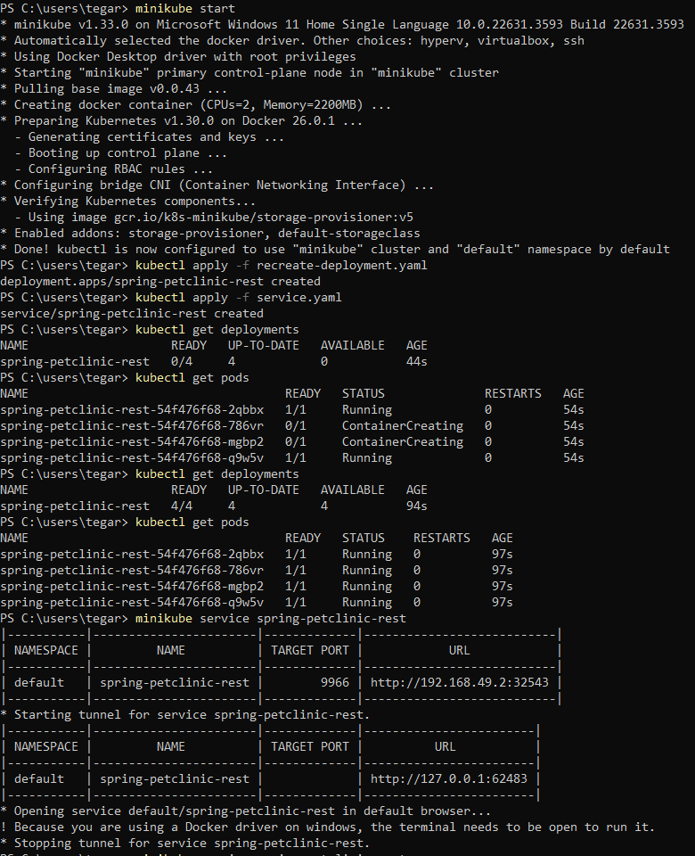
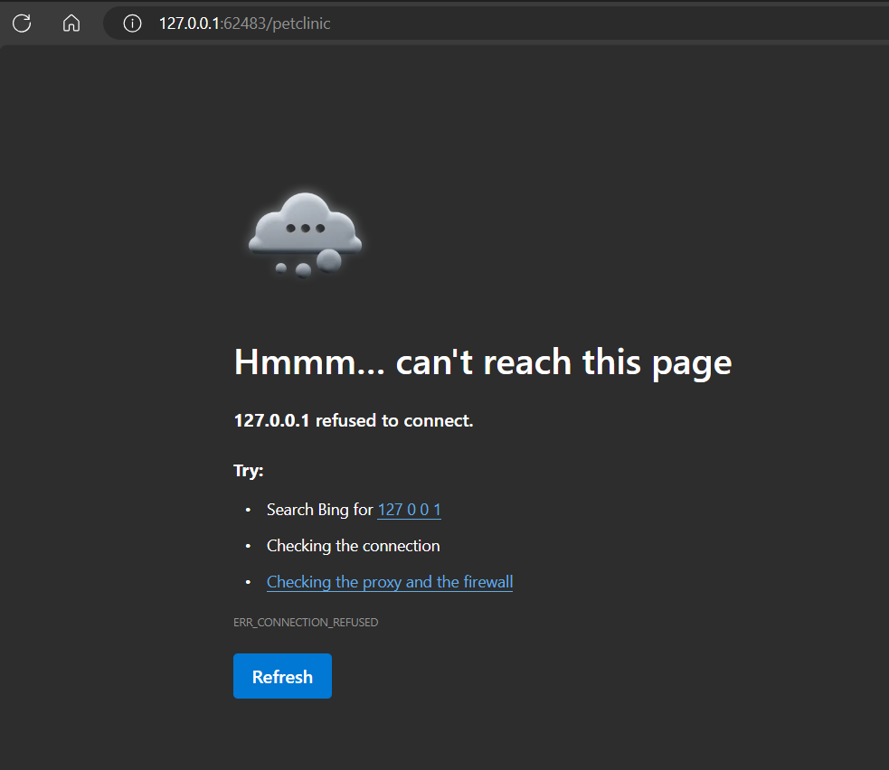

# Module 10 - Reflection
> Tegar Wahyu Khisbulloh (2206082032) - Pemrograman Lanjut A
## Reflection on Hello Minikube
**1. Compare the application logs before and after you exposed it as a Service. Try to open the app several times while the proxy into the Service is running. What do you see in the logs? Does the number of logs increase each time you open the app?**


>Sebelum aplikasi diekspos sebagai sebuah `Service` di Kubernetes, aplikasi hanya berjalan di dalam satu atau lebih `Pod` di dalam `cluster` Kubernetes. `Pod` ini hanya dapat diakses dari dalam `cluster` itu sendiri, dan tidak memiliki alamat IP atau port yang dapat diakses dari luar `cluster`. Log awal yang terlihat hanya mencatat informasi bahwa aplikasi telah dimulai dan siap menerima request pada port tertentu, seperti yang terlihat pada gambar 1. Namun, karena tidak ada request yang dapat masuk dari luar `cluster`, maka log aplikasi tidak akan bertambah.


>Setelah aplikasi diekspos sebagai sebuah `Service` di Kubernetes, `Service` ini akan bertindak sebagai *gateway* atau *access point* bagi aplikasi yang berjalan di dalam `Pod`. `Service` menyediakan sebuah IP dan port yang dapat diakses dari dalam maupun luar `cluster`. Ketika aplikasi diakses melalui `Service`, request HTTP akan diteruskan ke `Pod` yang menjalankan aplikasi tersebut. Setiap request yang masuk akan dicatat dalam log aplikasi, seperti terlihat pada gambar 2 dengan contoh log "GET /". Jumlah log akan terus bertambah setiap kali ada request baru yang masuk ke aplikasi melalui `Service` tersebut.

**2. Notice that there are two versions of kubectl get invocation during this tutorial section. 13 The first does not have any option, while the latter has -n option with value set to kube-system. What is the purpose of the -n option and why did the output not list the pods/services that you explicitly created?**

>Opsi `-n` dalam `kubectl get` digunakan untuk menyebutkan namespace tempat kita ingin melihat daftar resource. Ketika dijalankan tanpa opsi, `kubectl get` akan menampilkan resource di namespace default. Namun, dengan menambahkan `-n kube-system`, outputnya akan menampilkan pod dan service sistem yang berjalan di namespace `kube-system` (namespace khusus untuk komponen inti Kubernetes) bukan resource yang kita buat di namespace lain. Opsi ini memungkinkan kita mengelola resource di berbagai namespace dalam satu cluster, karena Kubernetes menggunakan namespace untuk memisahkan resource berdasarkan tim, proyek, atau environment.

## Reflection on Rolling Update & Kubernetes Manifest File
1. What is the difference between Rolling Update and Recreate deployment strategy?
>Dalam Kubernetes, ada dua strategi utama untuk memperbarui aplikasi: Rolling Update dan Recreate. 
>
>Rolling Update adalah strategi default yang secara bertahap mengganti replika aplikasi lama dengan yang baru satu per satu, sehingga tidak ada waktu henti dan aplikasi tetap tersedia selama proses pembaruan.
>
>Sebaliknya, Recreate menyebabkan waktu henti singkat karena semua pod yang ada akan dihentikan sebelum yang baru dibuat dengan konfigurasi terbaru, strategi ini lebih cepat tetapi berisiko gangguan layanan. 
>
>Rolling Update lebih cocok untuk production environment karena transisi antar versi aplikasi tanpa menghentikan layanan, sedangkan Recreate umumnya digunakan untuk development environment.
2. Try deploying the Spring Petclinic REST using Recreate deployment strategy and document your attempt.

Saya mencoba menggunakan recreate-deployment.yaml yang merupakan copy dari deployment.yaml dengan beberapa adjustment tapi untuk saat ini belum berhasil mengakses path `petclinic`. 

3. Prepare different manifest files for executing Recreate deployment strategy.
```yaml
apiVersion: apps/v1
kind: Deployment
metadata:
  annotations:
    deployment.kubernetes.io/revision: "4"
  creationTimestamp: "2024-05-17T11:48:08Z"
  generation: 5
  labels:
    app: spring-petclinic-rest
  name: spring-petclinic-rest
  namespace: default
  resourceVersion: "7362"
  uid: d2b23b5f-89d9-41bf-a188-316626c98002
spec:
  progressDeadlineSeconds: 600
  replicas: 4
  revisionHistoryLimit: 10
  selector:
    matchLabels:
      app: spring-petclinic-rest
  strategy:
    type: Recreate
  template:
    metadata:
      creationTimestamp: null
      labels:
        app: spring-petclinic-rest
    spec:
      containers:
      - image: docker.io/springcommunity/spring-petclinic-rest:3.2.1
        imagePullPolicy: IfNotPresent
        name: spring-petclinic-rest
        resources: {}
        terminationMessagePath: /dev/termination-log
        terminationMessagePolicy: File
      dnsPolicy: ClusterFirst
      restartPolicy: Always
      schedulerName: default-scheduler
      securityContext: {}
      terminationGracePeriodSeconds: 30
status:
  availableReplicas: 4
  conditions:
  - lastTransitionTime: "2024-05-17T11:48:08Z"
    lastUpdateTime: "2024-05-17T13:20:39Z"
    message: ReplicaSet "spring-petclinic-rest-54f476f68" has successfully progressed.
    reason: NewReplicaSetAvailable
    status: "True"
    type: Progressing
  - lastTransitionTime: "2024-05-17T13:26:57Z"
    lastUpdateTime: "2024-05-17T13:26:57Z"
    message: Deployment has minimum availability.
    reason: MinimumReplicasAvailable
    status: "True"
    type: Available
  observedGeneration: 5
  readyReplicas: 4
  replicas: 4
  updatedReplicas: 4

```
4. What do you think are the benefits of using Kubernetes manifest files? Recall your experience
in deploying the app manually and compare it to your experience when deploying the same app
by applying the manifest files (i.e., invoking `kubectl apply -f` command) to the cluster.
> Menggunakan manifest file Kubernetes memberikan beberapa manfaat dibandingkan deploy aplikasi secara manual. Manifest file mendefinisikan resourde Kubernetes seperti Deployment, Service, atau ConfigMap dalam format terstruktur YAML/JSON, sehingga deployment menjadi lebih konsisten, dapat direproduksi, dan mudah dikelola dalam satu tempat. Dengan menerapkan manifest file menggunakan perintah `kubectl apply -f`, deployment menjadi lebih cepat, terstandarisasi, dan menghindari kesalahan manual. Perubahan juga dapat dilacak dan dikelola dengan baik melalui kontrol versi manifest file. 